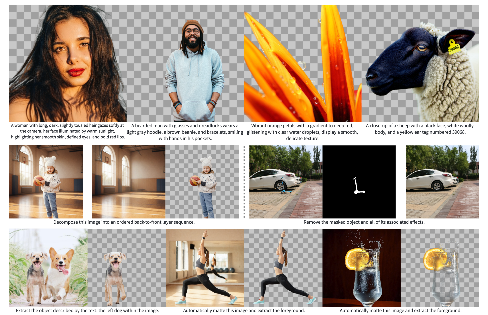

# OmniAlpha: A Sequence-to-Sequence Framework for Unified Multi-Task RGBA Generation

<p align="center">
  <a href="https://github.com/Longin-Yu/OmniAlpha"></a>
  <a href="https://arxiv.org/abs/2511.20211"></a>
  <a href="https://huggingface.co/Longin-Yu/OmniAlpha"></a>
</p>

---

**This is the official repository for "[OmniAlpha: A Sequence-to-Sequence Framework for Unified Multi-Task RGBA Generation](https://arxiv.org/abs/2511.20211)".**



---

## 📂 Project Structure

```
.
├── alpha/               # Core package
│   ├── data.py          # Dataset loading & preprocessing
│   ├── args.py          # Argument definitions
│   ├── inplace.py       # In-place operations
│   ├── pipelines/       # Inference pipelines (Qwen-Image-Edit)
│   ├── vae/             # AlphaVAE model & losses
│   ├── grpo/            # GRPO (RL) training utilities
│   └── utils/           # Utility functions
├── configs/             # Configuration files
│   ├── datasets.*.jsonc # Dataset configurations
│   ├── deepspeed/       # DeepSpeed configs (ZeRO-1/3)
│   ├── experiments/     # VAE experiment configs
│   └── accelerate.yaml  # Accelerate config
├── scripts/             # Bash scripts for training/inference
│   ├── train_qwen_image.sh          # Single-node training (Accelerate)
│   ├── train_qwen_image_torchrun.sh # Multi-node training (torchrun)
│   ├── vae_convert.sh   # VAE conversion script
│   ├── vae_train.sh     # VAE fine-tuning script
│   ├── infer.sh         # Inference script
│   ├── demo.sh          # Gradio demo script
│   └── rl/              # GRPO reinforcement learning scripts
├── tasks/               # Python/Jupyter task scripts
│   ├── diffusion/       # Diffusion training & inference
│   ├── vae/             # VAE fine-tuning, conversion & inference
│   ├── rl/              # GRPO RL training & preprocessing
│   └── demo/            # Gradio demo application
└── pyproject.toml       # Package definitions & dependencies
```

## 📦 Installation

### Step 1. Create a Conda Environment

```bash
conda create -n OmniAlpha python=3.10
conda activate OmniAlpha
```

### Step 2. Install OmniAlpha

First clone this repo and `cd OmniAlpha`. Then:

```bash
# Install OmniAlpha and all dependencies
pip install -e .
```

## ⚙️ Environment Variables

All scripts use environment variables to specify model/data paths. Set these before running any script:

```bash
# Model paths
export PRETRAINED_MODEL="Qwen/Qwen-Image-Edit-2509"  # HuggingFace model ID or local path
export VAE_MODEL_PATH="/path/to/vae/checkpoint"       # Path to AlphaVAE checkpoint
export LORA_PATH="/path/to/lora/pytorch_lora_weights.safetensors"  # Path to LoRA weights

# Data paths
export DATA_ROOT="/path/to/datasets"           # Root directory for all datasets
```

If not set, scripts will fall back to placeholder paths and you will need to edit them manually.

## 📄 Data Preparation

> Please refer to `configs/datasets.demo.jsonc` for dataset configuration examples.
> Each dataset entry consists of two required fields:
>
>   * `data_path`: Path to the JSONL annotation file.
>   * `image_dir`: Root directory for the dataset images.

### Dataset Format

The annotation file (`data_path`) should be a JSONL file with the following structure. Both `input_images` and `output_images` must be **relative paths** within `image_dir`:

```jsonl
{"id": "case_0", "prompt": "Vintage camera next to a brown glass bottle.", "input_images": ["images_512/case_0/base.png"], "output_images": ["images_512/case_0/00.png"]}
{"id": "case_1", "prompt": "A vintage-style globe with a map of North and South America, mounted on a black stand.;Antique key with ornate design, attached to a chain.", "input_images": ["images_512/case_1/base.png"], "output_images": ["images_512/case_1/00.png", "images_512/case_1/01.png"]}
...
```

### Dataset Configuration

Create a `.jsonc` config file under `configs/` to define datasets and splits:

```jsonc
{
    "datasets": {
        "my_dataset": {
            "data_path": "/path/to/datasets/my_dataset/annotations.jsonl",
            "image_dir": "/path/to/datasets/my_dataset"
        }
    },
    "splits": {
        "train": [{"dataset": "my_dataset", "ends": -50}],
        "valid": [{"dataset": "my_dataset", "starts": -50}]
    }
}
```

## 🔽 Model Download

[Pretrained model checkpoints are available on Hugging Face.](https://huggingface.co/Longin-Yu/OmniAlpha)

## 🚀 Inference

You can use the provided script to run inference with pretrained models.

1. **Configure**: Set environment variables (`PRETRAINED_MODEL`, `VAE_MODEL_PATH`, `LORA_PATH`) or edit `scripts/infer.sh` directly.
2. **Execute**:

    ```bash
    bash scripts/infer.sh
    ```

## 🎬 Demo

We provide a Gradio-based demo for interactive multi-task RGBA generation and editing.

### Supported Tasks

- `t2i` — Text-to-RGBA image generation
- `ObjectClear` — Object removal
- `automatting` — Automatic matting
- `refmatting` — Referential matting
- `layerdecompose` — Layer decomposition

### Execute

```bash
# Set model paths
export PRETRAINED_MODEL="Qwen/Qwen-Image-Edit-2509"
export VAE_MODEL_PATH="/path/to/models/OmniAlpha/rgba_vae"
export LORA_PATH="/path/to/models/OmniAlpha/lora/pytorch_lora_weights.safetensors"

# Launch demo
bash scripts/demo.sh
```

### Example Assets

Demo example images are placed in `tasks/demo/omnialpha/`.

## 🏋️ Training

### AlphaVAE Fine-tuning

```bash
# Step 1: Convert the base VAE to RGBA format
bash scripts/vae_convert.sh

# Step 2: Fine-tune the AlphaVAE
bash scripts/vae_train.sh
```

### LoRA Training (Single-Node with Accelerate)

```bash
bash scripts/train_qwen_image.sh
```

### LoRA Training (Multi-Node with torchrun)

For distributed training across multiple nodes:

```bash
# Set distributed training variables
export MASTER_ADDR="your_master_ip"
export MASTER_PORT=29500
export NNODES=2
export NPROC_PER_NODE=8
export MACHINE_RANK=0  # 0 for master, 1 for worker, etc.
export VERSION="omnialpha"  # Matches configs/datasets.<VERSION>.jsonc

bash scripts/train_qwen_image_torchrun.sh
```

### GRPO Reinforcement Learning

For RL-based fine-tuning:

```bash
# Run GRPO training
bash scripts/rl/train_grpo.sh
# Or for multi-node:
bash scripts/rl/train_grpo_torchrun.sh
```

## 🔗 Contact

Feel free to reach out via email at longinyh@gmail.com. You can also open an issue if you have ideas to share or would like to contribute data for training future models.

## Citation

```bibtex
@article{yu2025omnialpha0,
  title   = {OmniAlpha: A Sequence-to-Sequence Framework for Unified Multi-Task RGBA Generation},
  author  = {Hao Yu and Jiabo Zhan and Zile Wang and Jinglin Wang and Huaisong Zhang and Hongyu Li and Xinrui Chen and Yongxian Wei and Chun Yuan},
  year    = {2025},
  journal = {arXiv preprint arXiv: 2511.20211}
}
@misc{wang2025alphavaeunifiedendtoendrgba,
      title={AlphaVAE: Unified End-to-End RGBA Image Reconstruction and Generation with Alpha-Aware Representation Learning}, 
      author={Zile Wang and Hao Yu and Jiabo Zhan and Chun Yuan},
      year={2025},
      eprint={2507.09308},
      archivePrefix={arXiv},
      primaryClass={cs.CV},
      url={https://arxiv.org/abs/2507.09308}, 
}
```
